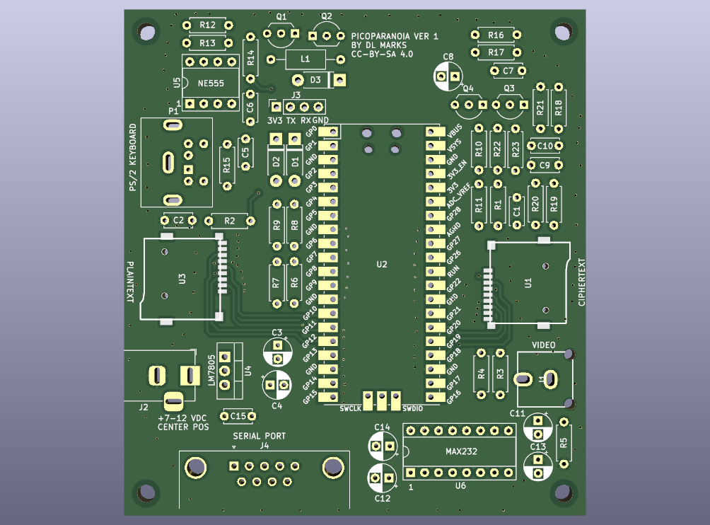

# PicoParanoia

This is an update to the ParanoiaBox ( https://www.github.com/profdc9/ParanoiaBox ) which uses a Raspberry Pi Pico rather than a STM32F103CBT6 Blue Pill.  It improves some security aspects of the original, such as having separate SPI ports for the ciphertext and plaintext cards.

